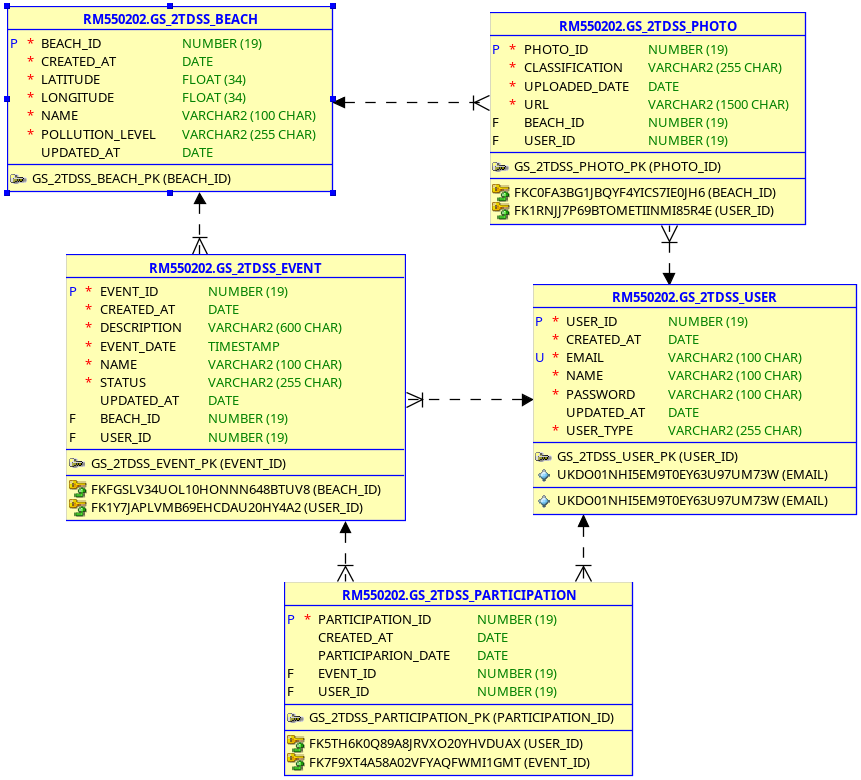

# CoastalCare

## Diagrama Entidade Relacionamento (DER)

## Rotas
| **Recurso**   | **Rota**                                       | **Método** | **Descrição**                                                       |
|---------------|------------------------------------------------|------------|---------------------------------------------------------------------|
| User          | /users                                         | POST       | Cria um usuário                                                     |
| User          | /users                                         | GET        | Busca todos os usuários                                             |
| User          | /users/:user_id                                | GET        | Busca usuário pelo ID                                               |
| User          | /users/by-name                                 | GET        | Busca os usuários por parte do nome                                 |
| User          | /users/by-email                                | GET        | Busca os usuários por parte do email                                |
| User          | /users/by-type                                 | GET        | Busca usuários pelo tipo                                            |
| User          | /users/by-type-count                           | GET        | Agrupa por tipo de usuário                                          |
| User          | /users/:user_id                                | PUT        | Atualiza um usuário                                                 |
| User          | /users/:user_id                                | DELETE     | Deleta um usuário                                                   |
| Beach         | /beaches                                       | POST       | Cria uma praia                                                      |
| Beach         | /beaches                                       | GET        | Busca todas as praias                                               |
| Beach         | /beaches/by-name                               | GET        | Busca todas por uma parte do nome                                   |
| Beach         | /beaches/by-pollution-level                    | GET        | Busca todas por nível de poluição                                   |
| Beach         | /beaches/by-pollution-level-count              | GET        | Agrupa por nível de poluição                                        |
| Beach         | /beaches/:beach_id                             | GET        | Busca praia pelo ID                                                 |
| Beach         | /beaches/:beach_id                             | PUT        | Atualiza uma praia                                                  |
| Beach         | /beaches/:beach_id                             | DELETE     | Deleta uma praia                                                    |
| Event         | /events/                                       | POST       | Cria um evento                                                      |
| Event         | /events                                        | GET        | Busca todos os eventos                                              |
| Event         | /events/:event_id                              | GET        | Busca evento pelo ID                                                |
| Event         | /events/by-name                                | GET        | Busca todos os eventos por pate do nome                             |
| Event         | /events/by-status                              | GET        | Busca todos os eventos por status                                   |
| Event         | /events/by-status-count                        | GET        | Agrupa por status                                                   |
| Event         | /events/:event_id                              | PUT        | Atualiza um evento                                                  |
| Event         | /events/:event_id                              | DELETE     | Deleta um evento                                                    |
| Participation | /participations                                | POST       | Registra usuário em um evento                                       |
| Participation | /participations/:participationId/users/:userId | PUT        | Confirma participação de usuário em um evento                       |
| Participation | /participations/users/:userId                  | GET        | Busca todas participações de eventos que um usuário está registrado |
| Participation | /participations/:participationId/users/:userId | DELETE     | Deleta participação de um usuário                                   |
| Photo         | /photos                                        | POST       | Adiciona uma foto                                                   |
| Photo         | /photos                                        | GET        | Busca todas as fotos                                                |
| Photo         | /photos/:photo_id                              | GET        | Busca foto pelo ID                                                  |
| Photo         | /photos/:beach_id                              | GET        | Busca todas as fotos de uma praia                                   |
| Photo         | /photos/:user_id                               | GET        | Busca todas as fotos que um usuário adicionou                       |
| Photo         | /photos/:photo_id                              | PUT        | Atualiza uma foto                                                   |
| Photo         | /photos/:photo_id                              | DELETE     | Deleta uma foto pelo id                                             |
|
